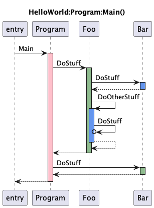

# Call Graph Generator

## Overview
The call graph generator will use [Roslyn](https://learn.microsoft.com/en-us/dotnet/csharp/roslyn-sdk/) 
to walk the call graph of a C# solution from a specified entry point and generate a [plant uml](https://plantuml.com/)
[sequence diagram](https://plantuml.com/sequence-diagram).




This sequence diagram text file can then be be turned into a diagram through a number of ways:
* https://www.planttext.com/
* [VS Code plugin](https://marketplace.visualstudio.com/items?itemName=jebbs.plantuml)
* [Rider plugin](https://plugins.jetbrains.com/plugin/7017-plantuml-integration)
* [Java executable](https://plantuml.com/download)

One suggestion is to generate SVGs if the call graph is large, as the SVGs can be zoomed in and out.


## Usage
```
PlantUml Call Grapher
Description:
PlantUml Call Grapher

Usage:
CallGraphGenerator <file> <namespace> <class> <method> [options]

Arguments:
<file>       The project or solution file to process.
<namespace>  Namespace of entry point
<class>      Class of entry point
<method>     Method entry point

Options:
-o, --output <output>  Optional output file
-l, --leaf <leaf>      Classes that should not be parsed further.
-i, --ignore <ignore>  Classes that should be completely ignored.
--version              Show version information
-?, -h, --help         Show help and usage information
```

### Example
The following example will run the call graph generator for the HelloWorld project, located
in the example folder, for the `Main()` method.
It will save the output in the `example.puml` file instead of outputing it to the standard output.

```sh
$ CallGraphGenerator/bin/Debug/net6.0/CallGraphGenerator \ 
    example/HelloWorld/HelloWorld/HelloWorld.csproj \ 
    HelloWorld Program Main \
    -o example.puml
```

The output should look like the graph at the top.


The one thing of note is that recursive calls are displayed with an arrow pointing
back to the same method, ending with a circle.

---
Copyright (c) 2023 Barnebys Group AB
